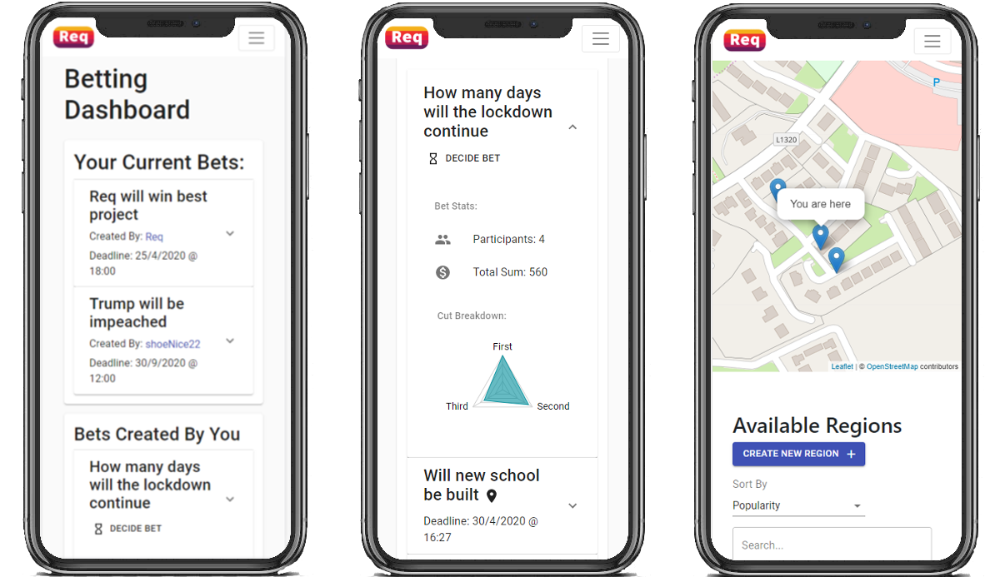

  

 

<h1 align="center">Real life based betting app</h1>
<h4 align="center"><a href="http://ec2-107-23-251-248.compute-1.amazonaws.com:3000">http://ec2-107-23-251-248.compute-1.amazonaws.com:3000</a></h4>

***

 
 

Req is a 2nd year software engineering group project made to be an app where anyone can bet on anything. Staying at home won't gain you the full experience offered by Req as many bets require you to physically be within a set radius of them in order to compete in them. All bet creators get 10% of the total amount of coins placed on their bets which incentives users to create the interesting and eye-catching bets to increase their wealth and (hopefully not) gamble it away.

## The Team

|  |  |  | 
| ------------- | :------------ | ------------- |
|Cathal O'Callaghan|Back end infrastructure/Front end UI ||
| Eoin Mc Ardle|Back end infrastructure/Front end UI |  |
|Karl Gordon|Front end UI/UX | |
|Rory Sweeney|Front end UI/UX | |

## What stack does Req use?

    

Req is a MERN stack application. Mern meaning Mongo, Express, React and NodeJS. Alongside this we have some scripts for backend services such as emailing and maintenance written in Go.
 
 

   

## User Interface

    

## The link doesn't work, did it crash?
Depending on when you're trying to access Req in the future it may or may not be up. Currently it's being hosted on AWS with free credits that we have but these are inevitably going to run out. If you're reading this and it's down why not watch the ~~video tour~~

